

  

    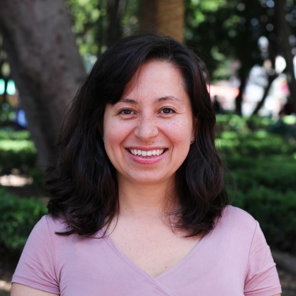
  

  

    <h1>Erika Díaz-Almeyda, Ph.D.</h1>
    
Assistant Professor of Biology and Environmental Studies 
      New College of Florida

    
<a href="mailto:ediazalmeyda@ncf.edu">E-mail</a> &nbsp;|&nbsp; <a href="https://scholar.google.com/citations?user=wlIHaV8AAAAJ" target="_blank">Google Scholar</a> &nbsp;|&nbsp; <a href="https://twitter.com/erikadiazal" target="_blank">Twitter</a>

  

<b>Core faculty member:</b> Biology &nbsp;|&nbsp; Marine Biology &nbsp;|&nbsp; Environmental Studies &nbsp;|&nbsp; Pritzker Marine Biology Research Center

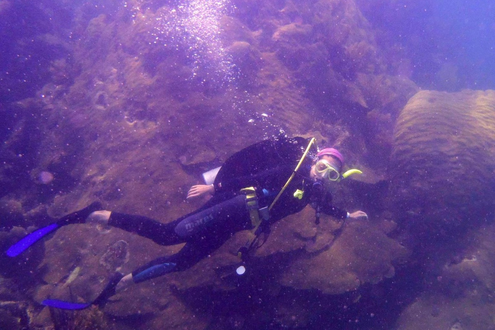
Professor Díaz-Almeyda diving at the Mesoamerican Barrier Reef.

<h1><i class="my-icon-h1"></i>Coastal Microbial Ecology Lab</h1>

Research in my lab investigates how climate change and rising sea temperatures affect marine symbiosis, and how anthropogenic stressors impact coastal microbial diversity. I use the ridge-to-reef framework to account for natural and social systems affecting the coast.

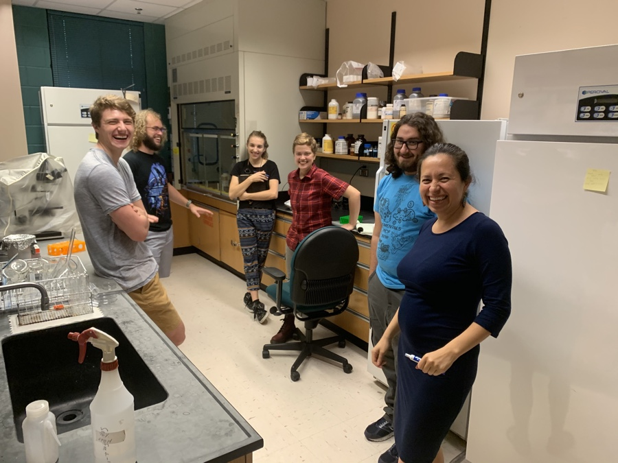
My fun and creative junior colleagues!

My lab is at a primarily undergraduate institution, and my students are mentored as junior research colleagues. They learn diverse approaches in marine research, including: fieldwork, experimental biology (genomics, host-symbiont physiology, experimental evolution), place- and community-based research inclusive of local stakeholders, collaborating with international teams, interdisciplinary work with social scientists and humanities scholars, and working with Indigenous communities (Mayans in the Yucatán Peninsula). My students co-author manuscripts, present at conferences, and continue research in graduate programs.

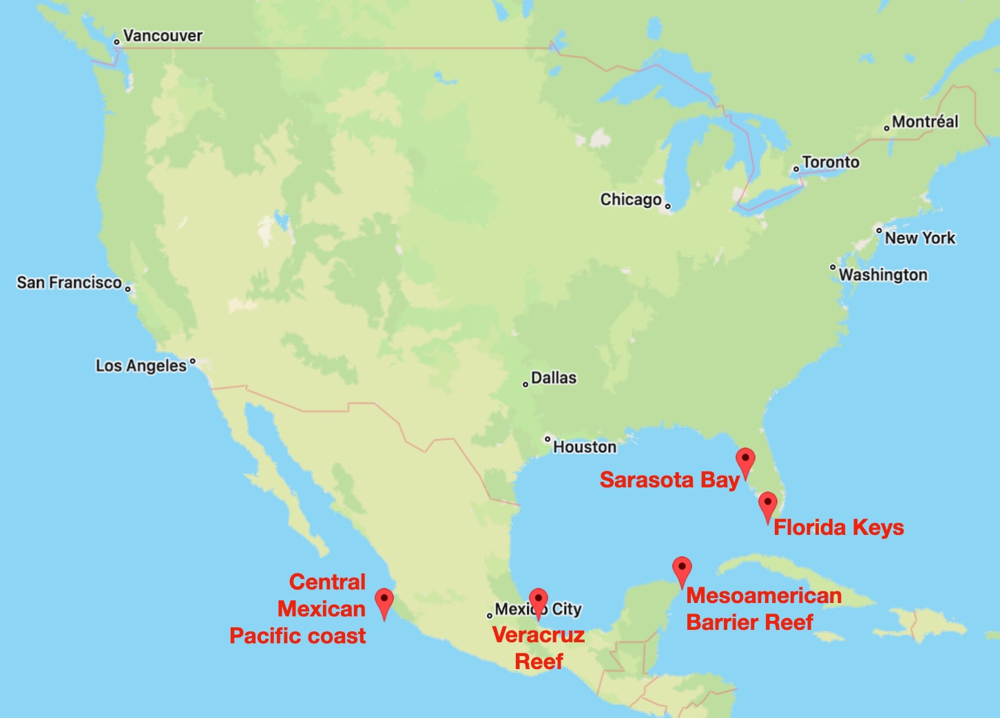
Map of field research sites.

Climate change and other anthropogenic stressors threaten symbiosis and microbial diversity, resulting in critical risks to the interdependent health of hosts, microbes, ecosystems, and, ultimately, people and coastal communities. My local and international field sites include: coastal sites near my institution; the Florida Keys; the two major coral reef systems in México—the Mesoamerican Barrier Reef System and the Veracruzano Reef System; and the central Mexican Pacific coast.

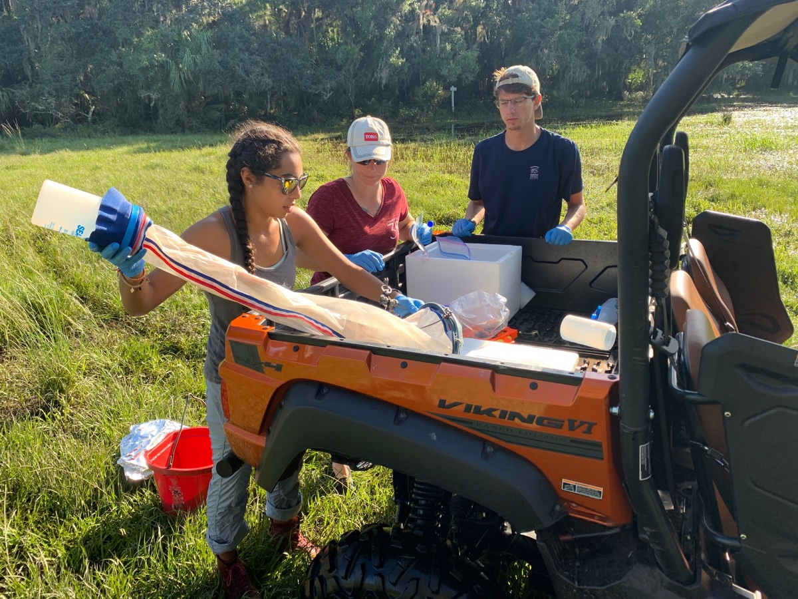
Undergraduate researchers during fieldwork at the Triangle Ranch Conservation Area.

In fieldwork, I collaborate with researchers at UNAM Puerto Morelos at the Mesoamerican Barrier Reef System, Universidad Veracruzana at the Veracruzano Reef System, and with MOTE Marine Laboratory in restoration efforts of reef-building corals in the Florida Keys.

Learn more <a href="#research">about my research</a>.

<h1><i class="my-icon-h1"></i>Lab News!</h1>

<b>Jul 22, 2022</b> - Congratulations to my amazing co-authors on our <a href="https://www.biorxiv.org/content/10.1101/2022.07.21.500558v1" target="_blank">recently submitted manuscript</a> on the upside-down jellyfish <i>Cassiopea xamachana</i>!

<b>Jun 24, 2022</b> - Our research on the <a href="http://www.scenesarasota.com/magazine/education-matters-studying-the-invisible-dr-erika-diaz-almeydas-research-on-microbiomes/" target="_blank">Florida Microbiome Project</a>, which aims to assess the health of our coastal ecosystems, was highlighted in the Sarasota SCENE. Congratulations to my amazing junior research collaborators!

<b>Jun 20, 2022</b> - Congratulations to my amazing co-authors on our <a href="https://www.preprints.org/manuscript/202206.0284/v1" target="_blank">recently submitted manuscript</a> on the dinoflagellate family Symbiodiniaceae!

<b>Jun 14, 2022</b> - Many thanks to the <b>Andrew W. Mellon Foundation</b> for their generous funding to support my work in developing CUREs (Course-based Undergraduate Research Experiences) to discover local microbes for community health.

<b>May 19, 2022</b> - Congratulations to <b>six of my amazing undergraduate researchers</b> on our accepted manuscript on <a href="https://www.frontiersin.org/articles/10.3389/fevo.2022.764086/full" target="_blank">the bacterial community associated with Symbiodiniaceae in culture</a>, now published in <i>Frontiers in Ecology and Evolution</i>!

<b>May 5, 2022</b> - Congratulations to my student presenters at <a href="https://www.ncf.edu/event/microbe-day/" target="_blank">the 4th Annual Microbe Day</a>! So many amazing presentations at the intersection of microbiology and the arts!

<b>Mar 21, 2022</b> - Congratulations to <b>two of my amazing undergraduate researchers</b> on co-authoring a manuscript we just submitted on <a href="https://ecoevorxiv.org/vj2zn/" target="_blank">Urban Food Forestry</a>!

<b>Feb 7, 2022</b> - Our research on the <a href="https://www.ncf.edu/news/news/the-florida-microbiome-project-mapping-microbial-communities-to-support-environmental-health/" target="_blank">Florida Microbiome Project</a> was recently highlighted in the New College News. Congratulations to my amazing junior research collaborators!

<b>Dec 17, 2021</b> - Many thanks to the Mind & Life Institute for <a href="https://www.mindandlife.org/grant/documenting-mayan-milpa-biocultural-heritage-through-embodied-ethnoecology/" target="_blank">awarding my lab with the Varela Grant</a>! This generous funding will support our research on Mayan traditional ecological knowledge in the Yucatán Peninsula.

<b>Nov 19, 2021</b> - Our new <a href="https://doi.org/10.3389/fcomm.2021.731839" target="_blank">article on inclusive science pedagogy</a> was published in <i>Frontiers in Communication</i>. Congratulations to my interdisciplinary co-authors (<a href="https://michaelromano.org" target="_blank">Michael Romano</a>, <a href="https://www.takingcharge.csh.umn.edu/our-experts/tenzin-namdul-dtms-ba-phccc" target="_blank">Tenzin Namdul</a>, and <a href="https://thubtenchodron.org/author/gesheyeshilhundup/" target="_blank">Geshe Yeshi Lhundup</a>)!

<b>Nov 3, 2021</b> - Congratulations to my interdisciplinary colleague in Anthropology, <a href="https://sites.google.com/a/ncf.edu/baram/" target="_blank">Uzi Baram</a>, on our recently published <a href="https://ncf-flvc.primo.exlibrisgroup.com/permalink/01FALSC_NCF/1ib1koo/alma99383194550206582" target="_blank">research report</a> exploring microbial communities at cultural heritage sites!

<b>Oct 27, 2021</b> - Congratulations to my co-organizers on hosting a successful Latin American Heritage campus event, featuring Mayan cultural scholar and activist, <a href="https://es.wikipedia.org/wiki/Pedro_Uc_Be" target="_blank">Pedro Uc Be</a>, presenting on <a href="https://awasqa.org/en/2021/10/06/what-is-maya-what-is-to-be-maya/" target="_blank">What is Maya, What Is To Be Maya?</a>

<b>Aug 24, 2021</b> - Congratulations to <b>six of my amazing undergraduate researchers</b> on co-authoring a manuscript we just submitted on the microbiome of <i>Symbiodinium</i> cultures!

<h1 id="research"><i class="my-icon-h1"></i>Climate change and symbiosis in marine invertebrates (corals, jellyfish)</h1>

Climate change disrupts coral-algal symbiosis, resulting in coral bleaching and death. I explore the interdependent relationships between symbiont diversity, thermal stress, and time, as they relate to coral reef health. Significant knowledge gaps remain regarding the diversity, coral host-compatibility, and thermotolerance of algal symbionts; questions central to coral reef restoration efforts.

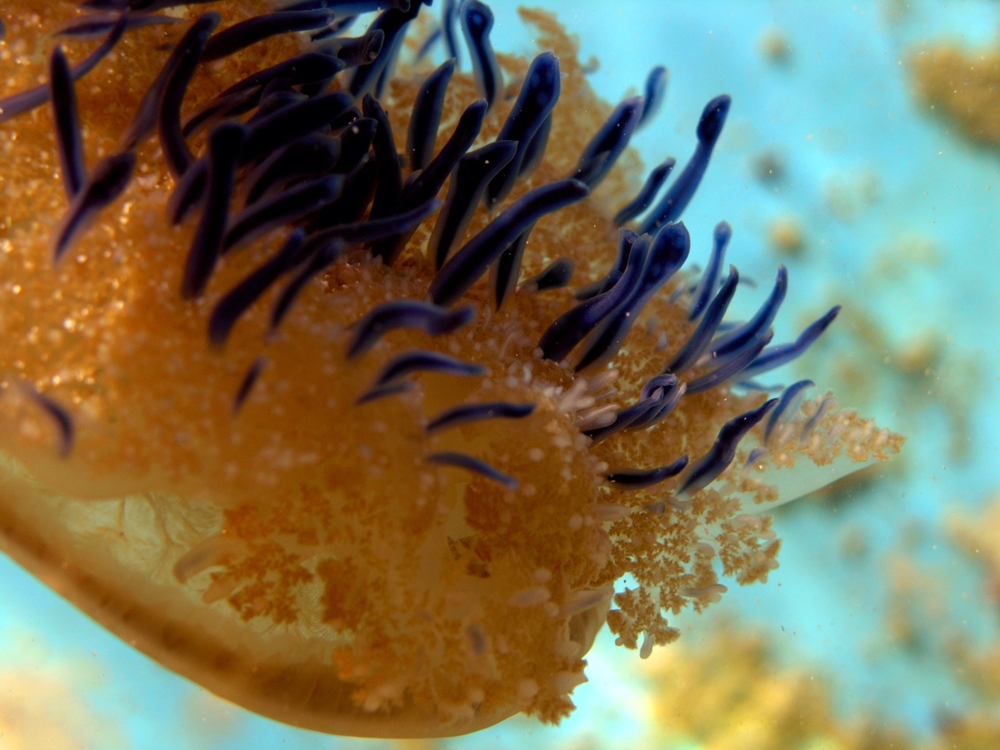
The upside-down jellyfish <i>Cassiopea xamachana</i>.

Using fieldwork and experimental biology, I study thermotolerance of Symbiodiniaceae (algal symbionts inside corals and jellyfish) to advance restoration efforts. My lab uses the upside-down jellyfish <i>Cassiopea xamachana</i> (a cnidarian, like coral) as a model organism to explore questions of host-microbe interactions, and to test novel approaches of growing Symbiodiniaceae. Jellyfish are low-maintenance and fast-growing, perfect for undergraduate and master’s theses compared with corals.

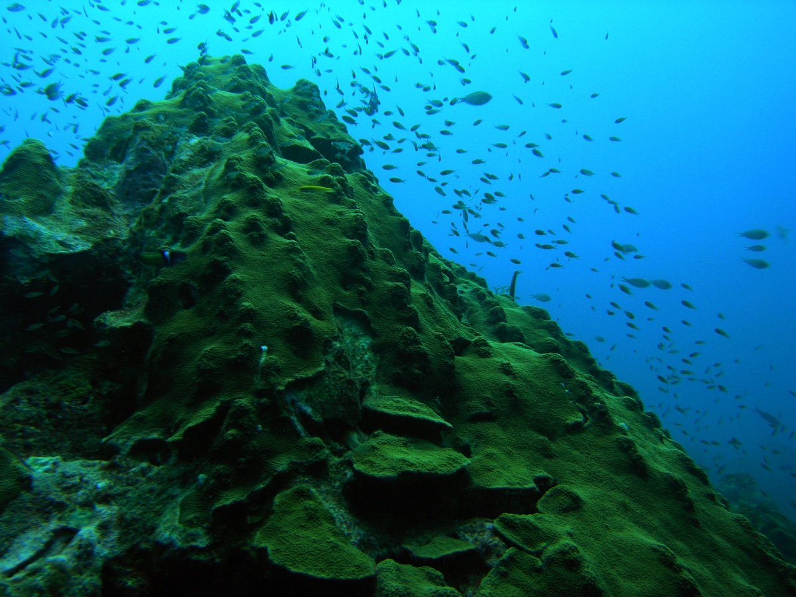
Colony of <i>Orbicella faveolata</i> coral in the field.

In physiology experiments, I explore the vast diversity of Symbiodiniaceae species, as I discovered that thermotolerance is not a phylogenetically conserved trait. Using genomics, I identify mechanisms of symbiont thermotolerance and chronobiology to explain coordination of coral-algal symbiosis. I also explore transcriptomic responses of <i>Orbicella faveolata</i>, a crucial reef-building coral susceptible to mass bleaching.

<h1><i class="my-icon-h1"></i>Microbial diversity in coastal ecosystems</h1>

Little is understood about place-based, long-term microbial diversity in coupled human-environment coastal systems. To fill this gap, I engage in longitudinal microbial diversity assessments at coastal sites (ocean, coastline, rivers) to establish diversity baselines, which can serve as an early warning indicator of ecosystem disruption, particularly in fragile coastal areas threatened by climate change, sea level rise, land-use runoff, and other anthropogenic impacts.

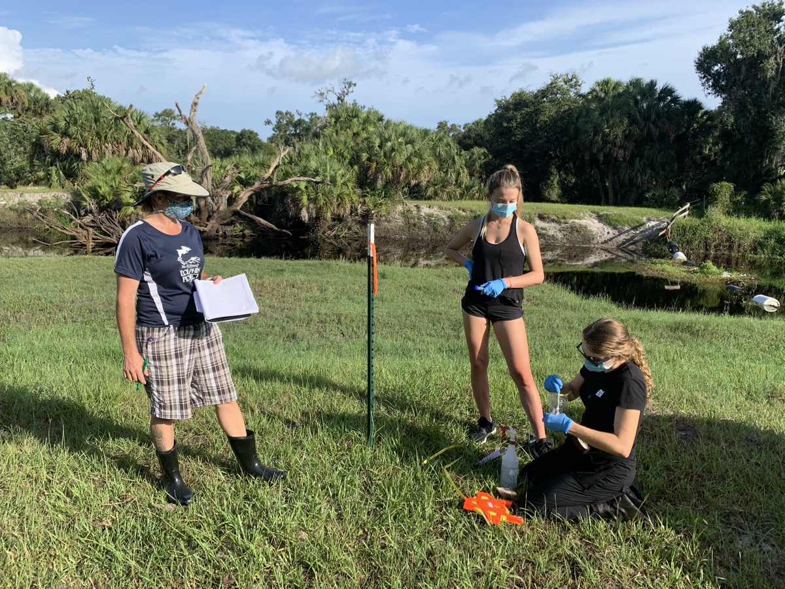
Undergraduate researchers during fieldwork at the Triangle Ranch Conservation Area.

I conduct longitudinal research at coastal sites near my institution, including: the Triangle Ranch Conservation Area; Florida Keys; seagrass biofilms; food forests; and the Florida House Institute. This research is perfect for undergraduate and master’s theses because the methodologies are quickly learned, and new students continue to grow datasets from previous years, raising new questions while providing new ways to answer them. I document land management practices, estimate water and soil nutrients, and generate biodiversity flora and microbial inventories. Long-term datasets support community stakeholders involved in water and land management. For example, coastal Florida has sandy soils with low water retention, increasing the flow of excess nutrients into rivers that flow into the Gulf, resulting in harmful algal blooms.

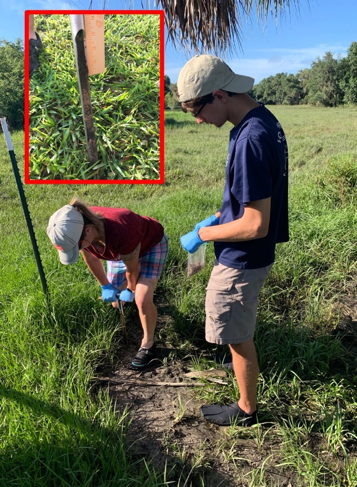
Undergraduate researchers during fieldwork at the Triangle Ranch Conservation Area.

With interdisciplinary colleagues, I assess microbial diversity at archaeological sites projected to be impacted by near-term sea level rise, such as microbes associated with tabby (an 18th century architectural material made from oyster shells) and other key material substrates at De Soto National Memorial on the Gulf Coast. We observed an increase of halotolerant bacteria and archaea, and bacteria associated with harmful algal blooms, suggesting that built environments can be reservoirs of harmful algae.

<h1><i class="my-icon-h1"></i>Education</h1>

  
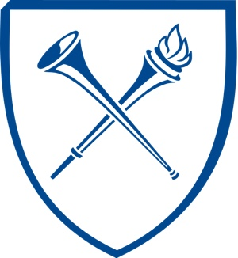

  

    
<b>NIH-FIRST Postdoctoral Fellow</b> 
      <a href="https://www.emory.edu" target="_blank">Emory University</a> 
      Department of Biology

  

  

  

    
<b>Ph.D. Biology</b> 
      <a href="https://www.psu.edu" target="_blank">Penn State University</a> 
      Department of Biology

  

  
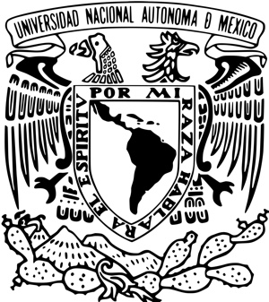

  

    
<b>M.Sc. Marine Sciences and Limnology</b> 
      <a href="https://www.unam.mx/" target="_blank">Universidad Nacional Autónoma de México (National Autonomous University of México)</a>, Puerto Morelos, Quintana Roo, México 
      Instituto de Ciencias del Mar y Limnología (Institute of Marine Sciences and Limnology)

  

  

  

    
<b>B.S. Biology</b> 
      <a href="https://www.unam.mx/" target="_blank">Universidad Nacional Autónoma de México (National Autonomous University of México)</a>, México City, México 
      Instituto de Ecología (Institute of Ecology)

  

